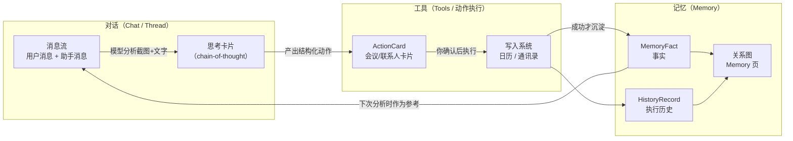
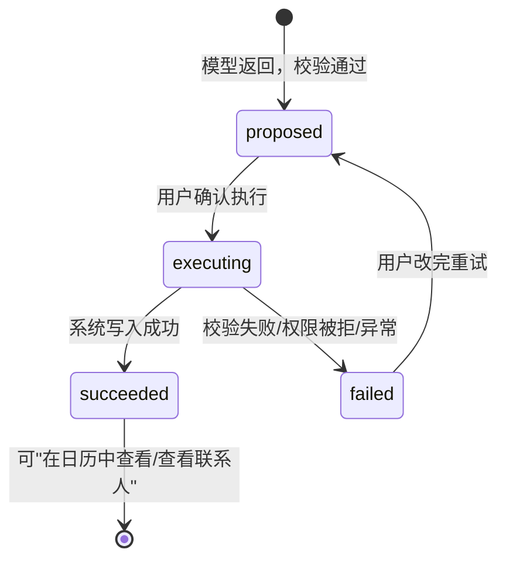

# ContactFlow Repo Wiki（新手友好版）

> 这份文档面向**第一次接触这个项目（甚至第一次接触这类"AI 聊天 + 工具调用"应用）**的读者。
> 它会先讲清楚"对话、记忆、工具"这三件事的关系，再带你走完一次完整的代码调用链，
> 最后给出每个核心字段的白话解释。对照源码阅读效果最好。
> 更新时间：2026-08-20（对应当前代码，不是产品规划）。

---

## 0. 一句话认识这个项目

ContactFlow 是一个 iOS 上的 AI 助手 App：**你把聊天截图发给它，它帮你从截图里读出"要不要建个会议、存个联系人"，列成卡片让你确认，确认后真正写进系统日历和通讯录，并把做过的事沉淀成"关系记忆"。**

---

## 1. 先建立整体图景：对话、记忆、工具

整个 App 只有三块核心概念，理解它们的关系就理解了一半代码。



用大白话说：

- **对话**是主界面。你发的每条消息（文字+截图）进入消息流，模型分析时你会看到一张"思考卡片"实时更新。对话的载体是 assistant-ui 的 **Thread（线程）**，一个会话（`ChatSession`）就是一条线程。
- **工具**是模型"想做的事"。模型本身不能碰你的日历和通讯录，它只能返回一段 JSON，描述"建议创建什么"。App 把这段 JSON 渲染成**动作卡片（ActionCard）**，你点"执行"，App 才调用系统 API 写日历/通讯录。**模型提议，人来确认，系统执行**——这是全 App 最重要的原则。
- **记忆**是执行成功后的沉淀。每成功执行一个动作，App 会写一条执行历史（`HistoryRecord`）和一条事实（`MemoryFact`，比如"林澈的手机号是 138…"）。记忆页的关系图就是用它们拼出来的。下次分析时，记忆会作为上下文喂给模型，让它"记得"这些人。

三者循环：**对话产生动作，动作沉淀记忆，记忆反哺对话。**

---

## 2. 技术选型（都是什么、为什么用它）

| 维度 | 选型 | 一句话说明 |
| --- | --- | --- |
| 包管理 | pnpm monorepo | 根目录管 workspace，App 在 `apps/mobile` |
| 语言 | TypeScript | 所有数据结构都有类型，编辑器会提示 |
| 框架 | Expo + Expo Router | 用写 React 的方式做 iOS 原生 App；`src/app/` 下的文件名就是路由 |
| UI | React Native 0.86 + React 19 | 组件化 UI |
| 聊天编排 | `@assistant-ui/react-native` | 负责消息流、思考卡片、输入框的"聊天骨架"，见第 4 节 |
| 全局状态 | Zustand | 一个全局 store 存所有业务数据（会话、动作、记忆……） |
| 持久化 | AsyncStorage + SecureStore | 业务数据存 AsyncStorage；**API Key 只存 SecureStore（系统钥匙串）** |
| 数据校验 | Zod | 模型返回的 JSON 必须过 schema 校验，不合格直接拒绝 |
| 原生能力 | expo-calendar / expo-contacts / expo-image-* 等 | 写日历、读写通讯录、压图 |
| 长按菜单 | react-native-context-menu-view | 会话列表长按弹的是 iOS 原生菜单 |
| 样式 | NativeWind + Gluestack + 手写 StyleSheet | 设计 token 集中在 `src/constants/theme.ts` |
| 测试 | Vitest | 跑纯逻辑测试（schema、store、agent），不碰 UI |

---

## 3. 代码地图：每个文件是干什么的

按"一次分析会经过的顺序"排列，建议也按这个顺序读代码。

| 文件 | 它是干什么的 |
| --- | --- |
| `src/app/index.tsx` | 聊天主屏。创建 assistant-ui runtime，把"分析"这件事接进聊天骨架；处理排队、会话切换、执行动作、生成洞察 |
| `src/components/chat-composer.tsx` | 底部输入框：文字、附件、发送/停止/排队按钮 |
| `src/components/chat-messages.tsx` | 消息渲染：用户气泡、助手消息、思考卡片、动作卡片的挂载点 |
| `src/services/analysis-runtime.ts` | **分析适配器**：把"分析"包装成 assistant-ui 能理解的一次 run（流式输出思考过程） |
| `src/services/openai-compatible-agent.ts` | 真正调模型的地方：拼提示词、发请求（支持 SSE 流式）、校验返回 |
| `src/services/image-input.ts` | 把截图压缩、转成 data URL，塞进模型请求 |
| `src/domain/actions.ts` | 所有核心业务类型 + zod schema（第 7 节的字段词典都在这里定义） |
| `src/domain/chat.ts` | 会话相关类型（`ChatSession` 等） |
| `src/store/use-contactflow.ts` | 全局 zustand store：所有业务数据的唯一存放处 |
| `src/native/action-executor.ts` | 原生执行器：把确认后的动作真正写进日历/通讯录 |
| `src/domain/relationship-memory.ts` | 把历史和记忆聚合成"联系人 + 时间线"，供记忆页使用 |
| `src/app/memory.tsx` | 记忆页：关系图 + 联系人详情 + 我的信息 |
| `src/app/history.tsx` | 历史页：所有执行成功的动作 |
| `src/components/action-card.tsx` | 动作卡片本体：展示、编辑、执行、查看结果 |
| `src/components/insight-card.tsx` | 洞察/建议卡片：展示、编辑邮件、拉起邮箱 App |
| `src/components/profile-editor.tsx` | "我的信息"展示卡 + 弹窗编辑器 |
| `src/components/chat-history-drawer.tsx` | 左侧抽屉：会话列表（长按原生菜单）、入口导航 |

---

## 4. 设计模式：代码为什么这么组织

这个项目用了几个经典模式，每个都用一句话解释 + 代码位置。

### 4.1 Adapter（适配器）模式 —— `analysis-runtime.ts`

**是什么**：assistant-ui 框架规定"模型必须长这样"（一个 `ChatModelAdapter` 接口：给它消息，它返回/流式产出内容）。而我们的分析逻辑（压图、拼提示词、校验 JSON）完全是自己的一套。适配器就是两者之间的翻译层。

**为什么**：这样 UI 层（消息流、思考卡片、停止按钮、排队）全部交给框架，业务层只管分析。两者随时可独立替换。

**在哪**：`createAnalysisAdapter()` 把 `analyzeContext()` 包成一个 async generator——框架每收到一个 `yield` 就更新一次思考卡片，所以你能看到思考过程逐字出现。

```ts
// 简化示意（src/services/analysis-runtime.ts）
async *run({ messages, abortSignal }) {
  yield { content: [{ type: "reasoning", text: "读取文字与截图…" }] };   // 思考卡片立刻显示
  const result = await analyzeContext({ ..., onThinking: t => ... });   // 模型边想边流回来
  yield { content: [ ...总结... ], metadata: { custom: { kind: "actions" } } };
}
```

### 4.2 Bridge（回调桥）模式 —— `AnalysisBridge`

**是什么**：适配器在框架内部运行，拿不到 React 组件里的最新状态（当前模型、语言、会话 id）。`index.tsx` 通过一组回调函数（`getContext / onRunStart / onRunSuccess / onRunError / onRunSettled`）把这些能力"借"给适配器。

**为什么**：适配器保持纯粹（不 import store、不碰 UI），方便测试；组件侧只需实现几个回调。

**在哪**：`index.tsx` 里的 `const bridge = useMemo(...)`。

### 4.3 Schema-first（契约优先）—— `domain/actions.ts`

**是什么**：模型返回的 JSON 长什么样，不是文档里写写，而是用 zod schema 钉死（`AnalysisResultSchema` 等）。返回内容**必须**通过 `safeParse`，多一个字段、少一个字段、类型不对，都会被拒绝。

**为什么**：LLM 输出天然不可靠，schema 是"不信任模型"的护城河。UI 拿到的永远是结构合法的数据。

**在哪**：`openai-compatible-agent.ts` 的 `requestStructuredOutput()`（请求时用 `response_format: json_schema + strict` 约束模型，返回后再用 zod 二次校验）。

### 4.4 单一状态源（Single Source of Truth）—— `use-contactflow.ts`

**是什么**：所有业务数据（会话、动作、记忆、历史、设置）都在一个 zustand store 里；UI 只读它，改数据只能通过 store 暴露的方法（`setActions`、`completeAction`……）。

**为什么**：任何页面看到的数据永远一致；配合 `persist` 中间件，重启 App 自动恢复。

**注意**：聊天消息本身**不**在这个 store 里——消息由 assistant-ui 的 runtime 管理（它有专门的消息仓库）。会话快照（`ChatSession`）才是 store 里的，用于持久化和恢复。

### 4.5 Primitive 组合模式 —— 组件层

**是什么**：assistant-ui 提供的是"无样式的行为零件"（`MessagePrimitive.Parts`、`ComposerPrimitive.Send`、`ChainOfThoughtPrimitive.Root`……），只负责行为和状态，长什么样完全由我们组装。

**为什么**：行为和样式解耦。比如"发送中变成停止按钮"这种逻辑由 `ComposerPrimitive.Cancel` 自带，我们只画了一个圆形按钮套上去。

### 4.6 命令队列（Queue）—— 分析排队

**是什么**：分析运行中再发消息，不会打断当前分析，而是进队列（`queuedTurn`），等上一轮结束后自动发送。

**在哪**：`index.tsx` 的 `flushQueuedTurn()`（在 `onRunSettled` 回调里触发）。

---

## 5. 一次完整调用链：从发送到写进日历

跟着这个故事走一遍，每个括号里是代码位置。

**第 1 步：发送**
你在输入框写字、选截图，点发送。`ComposerPrimitive.Send`（chat-composer.tsx）把消息交给 runtime，消息流里立刻出现你的气泡。
> 如果上一轮分析还在跑，发送按钮会变成"排队"（箭头）或"停止"（方块），排队消息会在上一轮结束后自动发出。

**第 2 步：runtime 启动分析**
runtime 发现新用户消息，调用适配器的 `run()`（analysis-runtime.ts）。适配器做三件事：从消息里拆出文字和附件（`turnFromUserMessage`）、通过 bridge 拿当前模型/语言/记忆（`getContext`）、通知界面"开始了"（`onRunStart`：清空旧卡片、保存会话）。
> 追问的场景：如果当前会话已有分析结果，`getContext` 还会带上上一轮的截图和动作列表（`previous`），模型会把"改到下午三点"理解成**修改原来的卡片**而不是新建一张。

**第 3 步：预处理 + 发请求**
`analyzeContext()`（openai-compatible-agent.ts）先压图（`image-input.ts`，大图压到 2000px/0.72，超体积再降到 1400/0.5），再拼提示词（系统规则 + 记忆 + 上一轮上下文），最后 `requestStructuredOutput()` 发请求。
> 请求是**流式**的（SSE）：模型先写 `thinking` 字段（它对截图的真实分析叙述），这段文字会被逐字解析出来（`extractPartialThinking`），实时流进思考卡片。流式失败会自动回退成普通请求，不影响结果。

**第 4 步：校验 + 变成卡片**
模型返回的 JSON 过 `AnalysisResultSchema.safeParse`（不合格 → 错误卡片 + 重试按钮）。通过后 `proposalsFromAnalysis()` 把每个"提议"补上 `id` 和 `status: "proposed"`，变成**动作卡片**渲染出来（chat-messages.tsx 读到消息 metadata 里的 `kind: "actions"` 就挂卡片）。

**第 5 步：你确认，系统执行**
你改卡片字段、点"执行"（权限模式不是 full 时会二次确认）。`execute()`（index.tsx）再做一次本地校验，然后 `executeNativeAction()`（action-executor.ts）申请权限、调用系统 API：建日历事件 / 建联系人 / 更新联系人。
> 成功后卡片变成"已确认完成"，并出现"在日历中查看 / 查看联系人"按钮——前者用 `calshow:` 协议跳到日历 App 的那一天，后者打开系统联系人卡片。

**第 6 步：沉淀记忆 + 生成建议**
执行成功 → `completeAction()`（store）写一条 `HistoryRecord`（历史页可见）+ 一条 `MemoryFact`（记忆页可见），然后自动生成"洞察 + 下一步建议"（`generateInsights`）。
> 如果建议是发邮件，卡片上会有"编辑/执行"按钮：执行直接用 `mailto:` 拉起邮箱 App，收件人/主题/正文全部预填好。

**第 7 步：关系图更新**
记忆页的 `buildRelationshipContacts()` 把历史和记忆按人名聚合成联系人节点和关系图——这就是"记忆"的最终形态。

---

## 6. 状态机

### 6.1 动作卡片的生命周期



### 6.2 分析的生命周期

`preparing_input`（拆消息、压图）→ `requesting_model`（发请求，思考流式输出）→ `validating_schema`（校验落地）。
用户点停止 → `CANCELLED`，保留已输出的思考内容，不报错。

### 6.3 会话的生命周期

发送即建/更新会话（`saveChatSession`）→ 分析完写入分析快照（`updateChatSessionAnalysis`）→ 切会话时 `thread.reset()` 重建消息流 → 重启 App 后从 AsyncStorage 恢复。

---

## 7. 字段词典（每个字段一句白话）

> 格式：类型名（定义位置）→ 逐字段解释。带 `?` 的是可选项。

### 7.1 会话相关（`src/domain/chat.ts`）

**`ChatAttachment`** —— 一张要发给模型的截图/图片。

- `uri?: string`：图片的本地文件地址。没有地址的是"示例占位图"，不会真的发给模型。
- `label: string`：图片的名字（比如"聊天截图"），只用于界面显示。
- `isDemo: boolean`：是不是内置示例图。示例图用来演示流程，不占用真实分析。

**`ChatTurn`** —— 一次发送的完整内容。

- `note: string`：你输入的那段文字。
- `attachments: ChatAttachment[]`：这条消息附带的图片列表。

**`ChatSession`** —— 一个会话的快照（存到本地，重启可恢复）。

- `id: string`：会话的唯一编号。
- `title: string`：会话标题（列表里显示的那行字），自动生成也可手动改。
- `modelConfigId?: string`：这次会话用的是哪个模型，方便切换回来时恢复。
- `isPinned?: boolean`：是否置顶（长按会话可以置顶）。
- `isTitleEdited?: boolean`：标题是不是你手动改的；改过的不会被自动覆盖。
- `turn: ChatTurn`：这个会话最后一次发送的内容，恢复会话时靠它重建消息。
- `analysis?: AgentAnalysis`：这个会话最近一次分析的结果快照（卡片 + 摘要）。
- `analysisDurationMs?: number`：上次分析花了多少毫秒，显示在"思考 X.Xs"里。
- `updatedAt: string`：最后更新时间，会话列表按它排序。

### 7.2 模型配置（`src/domain/model-config.ts`）

**`ModelConfig`** —— 一个模型连接配置。

- `id: string`：配置的唯一编号（API Key 在钥匙串里的 key 也用它）。
- `provider: string`：协议类型。目前真正可用的只有 `openai` / `deepseek` / `openai-compatible`（都走 Chat Completions 协议）。
- `model: string`：模型名，比如 `k3`、`gpt-4o`，直接写进请求体。
- `baseUrl: string`：接口地址；没带 `/chat/completions` 后缀时会自动补上。
- `hasApiKey: boolean`：标记"有没有存过 key"（只是标记；key 本体在系统钥匙串里，不进任何普通存储）。
- `createdAt` / `updatedAt: string`：创建/最后修改时间。

### 7.3 分析结果（`src/domain/actions.ts`）

**`Evidence`** —— 一条证据：模型说"我是从这里看出来的"。

- `source`：证据来源类型——`image`（截图）、`user_note`（你的文字）、`confirmed_memory`（已确认的记忆）、`system_default`（系统默认值，比如默认 30 分钟时长）。
- `sourceId: string`：证据编号，比如第 2 张图就是 `image:2`。洞察只能引用真实给过模型的证据编号，防止编造。
- `excerpt: string`：证据原文摘录（最多 160 字）。

**`ModelActionDraft`** —— 模型提议的一个动作（还没变成卡片）。

- `type`：动作类型，三选一：`create_meeting`（建会议）、`create_contact`（建联系人）、`update_contact`（更新联系人）。
- `confidence`：模型的把握程度 `high / medium / low`，展示在卡片右上角。
- `evidence: Evidence[]`：1~5 条证据，说明这个动作是从哪看出来的。
- `payload`：动作的具体内容，形状随 `type` 不同而不同（见下面三个 Payload）。

**`MeetingPayload`**（`create_meeting` 的内容）

- `title: string`：会议标题。
- `contactName: string`：相关联系人姓名——它是记忆页"同一个人归并"的关键。
- `startAt / endAt: string`：开始/结束时间（ISO 格式），强制要求结束晚于开始。
- `location: string`：地点，可空。

**`CreateContactPayload`**（`create_contact` 的内容）

- `givenName` / `familyName: string`：名 / 姓，至少填一个（防止建出无名联系人）。
- `phone: string`：手机号（必填，3~40 位）。
- `company: string`：公司，可空。
- `email: string`：邮箱，可空但格式必须合法。

**`UpdateContactPayload`**（`update_contact` 的内容）

- `contactName: string`：要更新谁的资料（执行时会弹系统联系人选择器让你选）。
- `company` / `jobTitle` / `email`：要更新的公司 / 职位 / 邮箱。

**`AnalysisResult`** —— 模型一次分析的完整返回（必须过 zod 校验）。

- `thinking: string`：模型的"思考叙述"——它对截图的实际分析过程。请求是流式的，这个字段最先输出，所以你能在思考卡片里看到它逐字出现。
- `contextSummary: string`：这段对话的摘要（也用来给会话起标题）。
- `participantNames: string[]`：识别到的参与人名单。
- `proposals: ModelActionDraft[]`：提议的动作列表，之后变成卡片。
- `notices: AnalysisNotice[]`：没法执行时的说明（比如"时间不明确"）。`code` 有四种：`NO_ACTION` / `AMBIGUOUS_TIME` / `LOW_IMAGE_QUALITY` / `MODEL_REFUSAL`，`message` 是给人看的说明。

**`InsightDraft`** —— 一条洞察或建议（执行成功后才生成）。

- `kind`：`insight`（关系洞察，比如"你们本月已见 3 次"）或 `suggestion`（下一步建议）。每次生成必须至少各一条。
- `title` / `body: string`：标题 / 正文。
- `evidenceIds: string[]`：这条结论引用的证据编号，必须来自真实给过模型的证据，否则整条结果被拒绝。
- `suggestedAction?`：**可执行的建议动作**。目前只有一种：`{ type: "send_email", to, subject, body }`——建议发邮件时带上完整草稿，卡片上就能直接"编辑 / 执行"拉起邮箱 App。`to` 只允许用上下文里真实出现过的邮箱，没有就留空。

### 7.4 执行时的对象

**`ActionProposal`** —— 一张动作卡片 = 模型提议（`ModelActionDraft`）+ 运行时状态。

- `id: string`：卡片编号（`action-<时间戳>-<序号>`），贯穿执行、历史、记忆全链路。
- `status`：卡片状态：`proposed`（待确认）→ `executing`（执行中）→ `succeeded`（已完成）/ `failed`（失败可重试）。
- `error?: string`：失败原因，显示在卡片上。
- `nativeObjectId?: string`：执行成功后系统返回的对象 id（日历事件 id / 联系人 id），"在日历中查看 / 查看联系人"按钮靠它定位。

**`NativeReceipt`** —— 系统写入成功的回执。

- `nativeObjectId: string`：系统对象 id（见上）。
- `executedAt: string`：执行完成时间。

**`HistoryRecord`** —— 一条执行历史（历史页的一行）。

- `id` / `actionId`：自身编号 / 对应的卡片编号。
- `type`：动作类型（会议还是联系人）。
- `title` / `contactName`：标题 / 联系人名（关系图按它归并）。
- `executedAt: string`：执行时间。
- `nativeObjectId: string`：系统对象 id。

**`MemoryFact`** —— 一条沉淀下来的事实（记忆页时间线的一条）。

- `id: string`：编号（`memory-<动作id>`）。
- `contactName: string`：属于哪个联系人。
- `label / value: string`：事实名 / 内容，比如 label="下一次互动"，value="8月25日 10:00"。
- `source: string`：事实来源（比如"已确认的日历事件"）。
- `createdAt: string`：生成时间。

### 7.5 关系图（`src/domain/relationship-memory.ts`）

**`RelationshipContact`** —— 记忆页里的一个联系人节点。

- `id: string`：节点编号（`relationship-<归一化人名>`）。
- `name: string`：显示名。
- `company?` / `jobTitle?` / `phone?` / `email?`：从历次成功动作和记忆里合并出来的最新资料。
- `facts: MemoryFact[]`：这个人的所有事实，新的在前。
- `meetings: ContactMeeting[]`：和这个人的会议（`ContactMeeting` 就是 `id / title / executedAt / scheduledAt?` 四个字段，分别是编号、标题、实际执行时间、原计划时间）。
- `lastActivityAt: string`：最近一次互动时间，联系人按它排序。

### 7.6 运行时元数据（`src/services/analysis-runtime.ts`）

**`AssistantMessageCustom`** —— 挂在助手消息上的"暗号"，决定消息下面要挂什么内容。

- `kind?`：`actions`（挂动作卡片）/ `insights`（挂洞察卡片）/ `error`（挂错误+重试）/ `insight-error`（洞察失败+重试）。没有就是纯文本消息。
- `elapsedMs?: number`：分析耗时，显示成"思考 X.Xs"。
- `errorText?: string`：错误文案。
- `insights?: unknown`：洞察内容的序列化快照（这样切换会话后洞察还能原样渲染）。

**`AnalysisBridge`** —— 适配器和主屏之间的回调桥（见 4.2）。

- `getContext()`：取当前语言 / 记忆 / 模型 / 上一轮分析（追问时用于更新旧卡片）。
- `onRunStart(turn)`：一轮分析开始：建/存会话、清空旧卡片。
- `onRunSuccess(result, durationMs)`：分析成功：卡片落地、写入会话快照。
- `onRunError(errorText)`：分析失败（震动反馈）。
- `onRunSettled()`：一轮结束（无论成败）：触发队列里的下一条消息。

### 7.7 全局 Store（`src/store/use-contactflow.ts`）

**`ContactFlowState`** —— 全 App 业务数据的唯一存放处。

- `actions: ActionProposal[]`：当前这轮分析出来的动作卡片（工作区，新分析会清空）。
- `history: HistoryRecord[]`：所有执行成功的历史，只增不改。
- `memories: MemoryFact[]`：所有沉淀的事实，只增不改。
- `insights: Insight[]`：最近一次生成的洞察与建议。
- `chatSessions: ChatSession[]`：所有会话快照。
- `modelConfigs` / `selectedModelConfigId`：模型配置列表 / 当前选中的配置 id。
- `permissionMode`：执行权限模式——`full`（点执行直接写系统）/ `ask`、`assist`（都会先弹二次确认）。
- `language` / `themeMode`：语言（中/英）/ 主题（深/浅）。
- `profile: UserProfile`：你的个人资料（`name` 昵称、`bio` 简介、`email` 邮箱、`avatarUri?` 头像——头像在选图时会复制到 App 的文档目录，重装不丢）。

持久化键：`contactflow:mvp:v1`（AsyncStorage）；API Key 永远只存 SecureStore（`contactflow.model-key.<配置id>`）。

---

## 8. "同一个人"是怎么被认出来的

系统用的是**同名归并**，不是模糊匹配：

1. 动作执行成功 → 写下 `HistoryRecord` 和 `MemoryFact`，都带着 `contactName`；
2. 记忆页聚合时，`contactKey()` 把人名做 `trim + 转小写` 归一化；
3. 归一化后相同的名字，历史、事实、会议全部合并到同一个 `RelationshipContact` 节点。

所以"林澈"和" 林澈 "（带空格）会归并，但"澈哥"、"Linche"不会——这是刻意保守，宁可不合并也不乱合并。

```text
能不能归并 = 执行成功过（在 history 里） 且 人名归一化后完全一致
```

---

## 9. 失败分支与恢复（哪里会坏、坏了怎么办）

| 坏在哪 | 错误码/表现 | 界面上的恢复方式 |
| --- | --- | --- |
| 没配模型 | 直接返回错误消息 | 错误卡片提示去模型设置 |
| 协议不支持 | `UNSUPPORTED_PROVIDER` | 换 openai / deepseek / 兼容协议 |
| 没存 Key | `MISSING_API_KEY` | 提示去补 Key |
| 配置不合法 | `INVALID_CONFIG` | 检查 baseUrl / 模型名 |
| 图片太大 | `IMAGE_TOO_LARGE` | 少选几张图 |
| 鉴权失败 / 限流 | `AUTHENTICATION` / `RATE_LIMITED` | 错误卡片 + 重试按钮 |
| 超时 / 断网 | `TIMEOUT` / `NETWORK` | 429 和 5xx 会自动重试一次；最终失败仍可手动重试 |
| 模型拒绝 / 输出不合规 | `MODEL_REJECTED` / `INVALID_RESPONSE` | 错误卡片 + 重试 |
| 用户主动停止 | `CANCELLED` | 静默停止，不报错，已输出的思考保留 |
| 执行失败 | 卡片标红 | 改完字段重试 |
| 更新联系人时取消选择 | `ActionCancelledError` | 静默，不当错误 |
| 洞察失败 | 消息列表底部错误条 | "重试洞察和建议"按钮 |

---

## 10. 排障速查

- **没有卡片产出**：先看思考卡片里模型实际写了什么；再看 notices 是否 `NO_ACTION`；再确认模型支持 `response_format.json_schema`。
- **卡片点不动**：卡片是否还在 `executing`？字段是否为空（`isActionValidForExecution` 会拦）？
- **洞察不出现**：只有动作**执行成功**才会生成；检查执行用的模型配置是否还在。
- **记忆页没更新**：关系图只来自**执行成功**的历史，分析成功但没执行的不会进。
- **追问没更新旧卡片**：确认是在**同一个会话**里追问（切会话后 `previous` 上下文才会带上）。

---

## 11. 推荐阅读顺序（上手路径）

1. 本文件的第 1、4、5 节（概念 + 模式 + 调用链）；
2. `src/app/index.tsx`（主屏怎么把一切接起来）；
3. `src/services/analysis-runtime.ts`（分析适配器，最核心的 100 行）；
4. `src/domain/actions.ts`（所有数据结构 + schema）；
5. `src/services/openai-compatible-agent.ts`（怎么调模型）；
6. `src/native/action-executor.ts`（怎么写系统）；
7. `src/store/use-contactflow.ts`（数据怎么存）；
8. 测试文件：`*.test.ts`——它们是行为边界的活文档。

```bash
# 日常开发
cd apps/mobile
pnpm start        # 起 Metro（App 从 8081 端口加载）
pnpm ios          # 构建并安装到模拟器
pnpm typecheck    # 类型检查
pnpm lint         # 代码规范
pnpm test         # 跑测试
```
