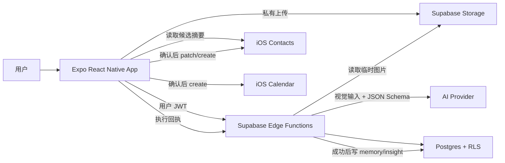
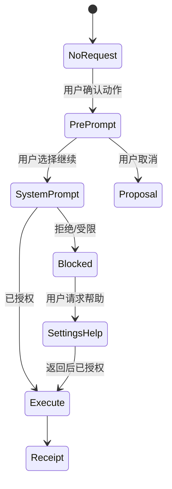
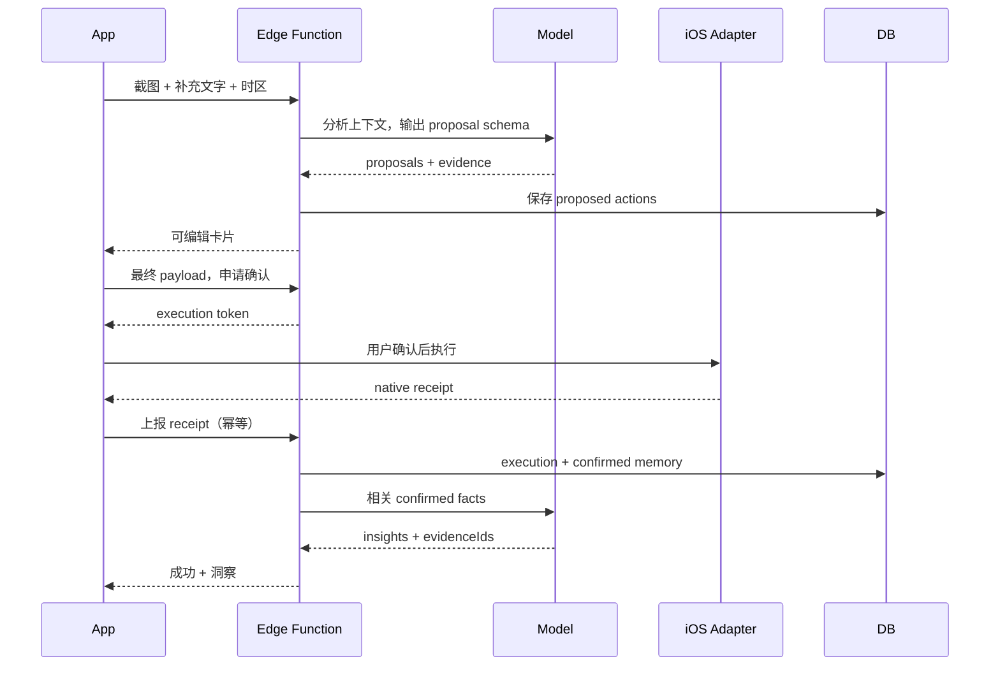

# ContactFlow React Native 技术方案

| 项目     | 内容                                                 |
| -------- | ---------------------------------------------------- |
| 文档版本 | v0.1                                                 |
| 对应 PRD | [ContactFlow PRD](PRD.md)                            |
| 客户端   | React Native + Expo + TypeScript                     |
| 后端     | Supabase（Auth、Postgres、Storage、Edge Functions）  |
| AI       | 支持视觉输入与 Structured Outputs 的模型，服务端调用 |
| 首要约束 | 48 小时完成 iOS 可运行闭环                           |

## 1. 技术目标

本方案要同时满足四点：

1. **快**：一套 TypeScript 技术栈完成 iOS 客户端、服务端函数和共享 schema；
2. **真**：行动确认后真实写入 iOS 日历/通讯录，不用假数据冒充执行；
3. **安全**：模型不拥有直接写设备数据的权限，AI Key 不下发客户端；
4. **可验证**：动作、记忆和洞察都有确定状态与来源，可通过 mock adapter 自动测试。

## 2. 关键技术决策

### 2.1 React Native 采用 Expo development build

选择 Expo SDK 57 的默认 TypeScript 模板和 Expo Router，使用 development build 进行真机/模拟器开发，不把 Expo Go 作为唯一运行环境。

理由：

- Expo 是 React Native 框架，提供统一的原生模块、构建和开发工具；
- Expo Router 是官方推荐的 Expo 导航方案，提供文件路由、typed routes 和 deep link；
- SDK 57 处于当前官方模板基线，具体依赖通过 `npx expo install` 安装兼容版本，避免手工拼接不兼容版本；
- React Native New Architecture 保持默认开启，除非某个已验证的 P0 原生模块阻塞。

官方依据：

- [Expo 创建项目](https://docs.expo.dev/get-started/create-a-project/)
- [Expo Router 介绍](https://docs.expo.dev/router/introduction/)
- [React Native New Architecture](https://reactnative.dev/architecture/landing-page)

### 2.2 原生动作在客户端执行

服务端只分析并生成 action proposal；客户端在用户确认后，使用本机权限调用日历或通讯录 API。模型和后端不能绕过客户端确认直接执行。

这样做的原因：

- iOS 权限与系统对象本来就在设备端；
- 确认 UI 和原生调用位于同一可信边界，易于证明“确认后执行”；
- 系统联系人 ID 无需暴露给 AI；
- 后端只保存最小化回执，降低隐私风险。

### 2.3 Supabase 作为 48 小时后端

使用 Supabase 提供：

- Auth：匿名用户身份，生成稳定 `user_id`；
- Postgres：动作、记忆、洞察和审计记录；
- Row Level Security：按 `auth.uid()` 隔离用户数据；
- Storage：私有截图临时存储；
- Edge Functions：验证用户、调用 AI、运行 schema 校验与记忆检索。

Edge Functions 适合短时 AI 编排，密钥保存在服务端 secrets 中。客户端只持有 publishable key 和用户 session，不持有 service role 或 AI Key。

官方依据：

- [Supabase + Expo React Native](https://supabase.com/docs/guides/getting-started/quickstarts/expo-react-native)
- [Supabase Edge Functions](https://supabase.com/docs/guides/functions)
- [保护 Edge Functions](https://supabase.com/docs/guides/functions/auth)

### 2.4 Structured Outputs，不解析自由文本

AI 分析必须输出符合 JSON Schema 的结构体，服务端再用 Zod 做第二次运行时校验。结构化输出能确保必填 key、枚举值和联合类型稳定；模型拒绝与普通失败分开处理。

模型通过环境变量 `OPENAI_MODEL` 配置。默认选择当时可用、支持图片输入和 Structured Outputs 的模型；上线前用固定测试集比较准确率、延迟和成本，不把具体模型名散落在业务代码里。

官方依据：

- [OpenAI Structured Outputs](https://developers.openai.com/api/docs/guides/structured-outputs)
- [OpenAI 图片与视觉输入](https://developers.openai.com/api/docs/guides/images-vision)

### 2.5 Memory 先做关系型可追溯存储

MVP 不引入向量数据库。联系人规模和单人记忆量有限，使用联系人绑定、类型、时间和状态查询更稳定，也能准确删除和解释来源。向量检索只有在真实数据证明关键词/结构化检索召回不足后再增加。

## 3. 总体架构



信任边界：

- AI 只看到当前截图、补充文字和最少量相关记忆；
- AI 输出是“提案”，不是命令；
- Edge Function 负责身份、schema 和业务校验；
- App 负责最终确认、权限和原生执行；
- Postgres 只在收到可验证的执行回执后写入完成型记忆。

## 4. Monorepo 建议结构

```text
ContactFlow/
├── apps/
│   └── mobile/
│       ├── src/app/                 # Expo Router 页面
│       ├── src/components/          # UI 与 action cards
│       ├── src/features/            # capture/actions/contacts/memory
│       ├── src/native/              # Calendar/Contacts adapters
│       ├── src/services/            # Supabase、upload、sync
│       └── src/store/               # 本地草稿与执行队列
├── packages/
│   ├── contracts/                   # Zod schema、DTO、枚举
│   └── test-fixtures/                # 脱敏截图和期望结果
├── supabase/
│   ├── functions/
│   │   ├── analyze-capture/
│   │   ├── validate-action/
│   │   ├── record-execution/
│   │   └── delete-user-data/
│   ├── migrations/
│   └── seed.sql
├── e2e/                             # Maestro 流程
├── docs/
├── .env.example
├── pnpm-workspace.yaml
└── package.json
```

为 48 小时控制复杂度，Edge Functions 共享的代码放在 `supabase/functions/_shared`，`packages/contracts` 通过构建步骤生成可被 Deno 与客户端消费的纯 TypeScript schema，避免运行时出现 Node-only 依赖。

## 5. 客户端设计

### 5.1 页面路由

```text
src/app/
├── _layout.tsx
├── (tabs)/
│   ├── _layout.tsx
│   ├── index.tsx                    # 处理
│   ├── history.tsx
│   └── contacts.tsx
├── analysis/[runId].tsx
├── contact/[contactId].tsx
└── settings.tsx
```

### 5.2 状态分类

- **服务端状态**：分析、action proposals、历史、memory、insights，使用 TanStack Query；
- **本地 UI 状态**：卡片展开、编辑草稿、permission pre-prompt，组件状态或小型 Zustand store；
- **必须持久化的设备状态**：Supabase session、待上报执行回执、幂等键，使用 Expo SQLite/安全存储；
- **系统事实**：日历事件与通讯录联系人，每次执行前通过 native adapter 重新读取。

不把服务端实体复制进全局 store，避免多套缓存互相覆盖。

### 5.3 Native adapter

定义业务层稳定接口，屏蔽 Expo API 版本变化：

```ts
export interface ContactsAdapter {
  getPermission(): Promise<PermissionState>;
  requestPermission(): Promise<PermissionState>;
  findCandidates(hints: ContactHints): Promise<ContactCandidate[]>;
  create(
    input: CreateContactInput,
    idempotencyKey: string,
  ): Promise<NativeContactReceipt>;
  patch(
    input: PatchContactInput,
    idempotencyKey: string,
  ): Promise<NativeContactReceipt>;
}

export interface CalendarAdapter {
  getPermission(): Promise<PermissionState>;
  requestPermission(): Promise<PermissionState>;
  listWritableCalendars(): Promise<WritableCalendar[]>;
  checkConflicts(range: DateRange): Promise<CalendarConflict[]>;
  create(
    input: CreateMeetingInput,
    idempotencyKey: string,
  ): Promise<NativeEventReceipt>;
}
```

生产 adapter 使用 `expo-contacts` 与 `expo-calendar` 的当前 class API；测试 adapter 使用内存实现。旧的 `Contacts.addContactAsync`、`updateContactAsync` 等 legacy API 已被官方标记为 deprecated，不用于新代码。

官方依据：

- [Expo Contacts](https://docs.expo.dev/versions/latest/sdk/contacts/)
- [Expo Calendar](https://docs.expo.dev/versions/latest/sdk/calendar/)
- [迁移到新版 Expo Calendar API](https://docs.expo.dev/guides/sdk-libraries-migration/calendar/)

### 5.4 权限流程



分析阶段不请求通讯录/日历权限。联系人候选匹配只有在该类 action 需要确认时才触发；如果只有创建会议且没有联系人匹配需求，只请求日历权限。

### 5.5 动作执行状态机

```text
draft
  └─> proposed
       ├─> needs_input ─> edited ─┐
       ├─> edited ────────────────┤
       ├─> cancelled              │
       └──────────────────────────> confirmed
                                      └─> executing
                                           ├─> succeeded
                                           ├─> failed_retryable
                                           └─> failed_terminal
```

约束：

- 只有 `confirmed` 可以进入 `executing`；
- 确认事件包含 proposal version 和最终 payload hash；
- action 编辑后 version +1，旧确认失效；
- `succeeded` 是终态；
- retry 复用同一幂等键，并先检查本地 receipt；
- 原生写入成功但网络失败时，本地保存 receipt，恢复后只上报，不再次写系统。

## 6. 共享数据契约

### 6.1 Action proposal

建议用 Zod discriminated union 定义三类模型草稿。模型不能生成数据库主键和状态版本；`id`、`version` 与初始 `status` 由服务端在草稿通过校验后补充：

```ts
const EvidenceSchema = z.object({
  source: z.enum(["image", "user_note", "confirmed_memory", "system_default"]),
  sourceId: z.string(),
  excerpt: z.string().max(160),
});

const BaseActionDraftSchema = z.object({
  confidence: z.enum(["high", "medium", "low"]),
  evidence: z.array(EvidenceSchema).min(1).max(5),
  missingFields: z.array(z.string()),
  warnings: z.array(z.string()),
});

const ModelActionDraftSchema = z.discriminatedUnion("type", [
  BaseActionDraftSchema.extend({
    type: z.literal("create_meeting"),
    payload: CreateMeetingInputSchema,
  }),
  BaseActionDraftSchema.extend({
    type: z.literal("create_contact"),
    payload: CreateContactInputSchema,
  }),
  BaseActionDraftSchema.extend({
    type: z.literal("update_contact"),
    payload: PatchContactInputSchema,
  }),
]);

type ActionProposal = z.infer<typeof ModelActionDraftSchema> & {
  id: string;
  version: number;
  status: "proposed" | "needs_input";
};
```

`sourceId` 指向本次 artifact、用户补充或 memory fact。`excerpt` 只保留支持该字段的最短脱敏片段，不保存整段 OCR 文本。

### 6.2 分析结果

```ts
type AnalysisResult = {
  runId: string;
  contextSummary: string;
  participantHints: ContactHints[];
  proposals: ActionProposal[];
  notices: Array<{
    code:
      | "NO_ACTION"
      | "AMBIGUOUS_TIME"
      | "LOW_IMAGE_QUALITY"
      | "MODEL_REFUSAL";
    message: string;
  }>;
};
```

### 6.3 执行回执

```ts
type ExecutionReceipt = {
  actionId: string;
  actionVersion: number;
  payloadHash: string;
  idempotencyKey: string;
  status: "succeeded" | "failed";
  nativeObjectType: "calendar_event" | "contact";
  nativeObjectId?: string;
  executedAt: string;
  errorCode?: string;
};
```

服务端校验 action 所属用户、版本、payload hash 和状态，拒绝用旧 payload 冒充已确认执行。需要说明的是，普通 iOS App 无法向服务端提供可验证的 EventKit/Contacts 远程证明；native receipt 是已登录客户端的执行声明。execution token 能证明“这个 payload 已经经过确认”，但不能单独证明设备对象必然存在。服务端因此只基于最小回执更新产品状态，设备端仍是系统联系人/日历对象的事实源。

## 7. 后端流程

### 7.1 `analyze-capture`

输入：`artifactId`、补充文字、设备时区、当前本地时间、locale。

步骤：

1. 验证 JWT 与 artifact 所属关系；
2. 检查相同输入 hash 是否已有成功分析，避免重复调用；
3. 生成短期 Storage signed URL 或在服务端读取图片；
4. 加载用户明确偏好，不加载全量联系人记忆；
5. 调用支持视觉输入与 Structured Outputs 的模型；
6. 使用 Zod 解析并执行确定性校验：日期、邮箱、手机号、枚举和字符串长度；
7. 保存 analysis run 和 proposals；
8. 返回结构化结果；
9. 安排原始 artifact 的过期删除时间。

48 小时版本先用同步请求；若 P95 接近平台超时，再改为 job + polling，不在第一版提前引入队列。

### 7.2 `validate-action`

在用户编辑完成、点击确认前调用：

- 重新校验必填字段和 payload schema；
- 将相对时间全部固定成带时区的 ISO 8601；
- 计算 canonical JSON 的 SHA-256 `payloadHash`；
- 将 action version 和状态更新为 `confirmed`；
- 返回短期 `executionToken`，绑定 `userId + actionId + version + payloadHash`。

客户端只有拿到 token 后才能进入原生执行。token 用于审计，不是原生 API 的权限凭证。

### 7.3 `record-execution`

输入执行回执和 `executionToken`：

1. 验证 token、action version、payload hash 与幂等键；
2. 使用数据库唯一约束幂等写入 execution log；
3. 成功回执将 action 标记为 `succeeded`；
4. 从最终 payload 生成 `confirmed` memory facts；
5. 读取与目标联系人相关的最小记忆集；
6. 生成带 evidence IDs 的 insights；
7. 返回 memory 和 insight 摘要。

失败回执只记录错误与重试能力，不写完成型 memory。

## 8. 数据库设计

### 8.1 核心表

| 表                    | 核心字段                                                                                                      | 说明                   |
| --------------------- | ------------------------------------------------------------------------------------------------------------- | ---------------------- |
| `profiles`            | `user_id`, `locale`, `timezone`, `raw_artifact_ttl_hours`                                                     | 用户偏好               |
| `source_artifacts`    | `id`, `user_id`, `storage_path`, `sha256`, `expires_at`, `deleted_at`                                         | 临时截图来源           |
| `analysis_runs`       | `id`, `user_id`, `artifact_id`, `input_hash`, `status`, `summary`, `model`, `latency_ms`                      | 分析任务               |
| `contacts`            | `id`, `user_id`, `display_name`, `native_contact_id`, `native_device_id`                                      | ContactFlow 联系人绑定 |
| `contact_identifiers` | `contact_id`, `kind`, `normalized_hash`, `masked_value`, `is_current`                                         | 手机/邮箱索引          |
| `action_proposals`    | `id`, `run_id`, `user_id`, `type`, `version`, `payload`, `payload_hash`, `status`                             | 行动状态源             |
| `action_evidence`     | `action_id`, `source_type`, `source_id`, `excerpt`                                                            | 动作依据               |
| `action_executions`   | `id`, `action_id`, `idempotency_key`, `status`, `native_object_id`, `executed_at`, `error_code`               | 执行审计               |
| `memory_facts`        | `id`, `user_id`, `contact_id`, `kind`, `value`, `status`, `valid_from`, `valid_to`, `source_id`, `deleted_at` | 可追溯记忆             |
| `insights`            | `id`, `user_id`, `contact_id`, `text`, `rationale`, `confidence`, `created_at`                                | 洞察                   |
| `insight_evidence`    | `insight_id`, `memory_fact_id`                                                                                | 洞察依据               |

敏感标识符：

- 用标准化值的带服务端 pepper HMAC 做匹配索引，不用裸手机号/邮箱做日志索引；
- 展示值只保存掩码；
- 真正写入系统通讯录的字段保留在设备端和最终 action payload 中，action payload 按最短业务保留期清理；
- `native_contact_id` 绑定 `native_device_id`，避免换设备后误认为仍可写。

### 8.2 关键约束

```sql
unique (user_id, input_hash) where status = 'succeeded';
unique (action_id, idempotency_key);
check (version > 0);
check (status in (...));
```

每张业务表都包含 `user_id`。RLS 基线：

```sql
using (auth.uid() = user_id)
with check (auth.uid() = user_id)
```

Storage path 固定为 `${user_id}/${artifact_id}`，对象策略同时校验第一段路径与 `auth.uid()`。

## 9. Memory 算法

### 9.1 写入

只从以下来源创建 `confirmed` fact：

- 成功执行动作的最终 payload；
- 用户在记忆页明确确认的资料；
- 用户明确设置的偏好。

AI 的截图提取存为 `observed`，默认不进入后续模型上下文。对于 `company`、`phone`、`email` 等当前属性，新 confirmed fact 写入时：

1. 查找同 kind 的 current fact；
2. 值相同则增加新 evidence，不创建重复 current fact；
3. 值不同则关闭旧 fact 的 `valid_to`，新 fact 成为 current；
4. 若来源仅为 observed，则保持待确认，不改变 current。

### 9.2 读取

```text
目标 contact
  → 当前 profile facts（姓名、公司、联系方式摘要）
  → 最近 5 条成功 interaction/event facts
  → 最多 3 条用户偏好
  → 按当前 action 类型过滤
  → 总字符/token 预算裁剪
```

创建会议优先检索：时区、常用时段、最近承诺和近期会议；更新联系人优先检索：当前字段、历史变更和标识符。不同联系人之间不共享事实。

### 9.3 洞察校验

模型输出必须包含 `evidenceIds`。服务端在保存前验证：

- evidence 属于当前用户和联系人；
- fact 状态是 confirmed 且未删除；
- evidence 数量 1～3；
- 文本不声称动作已执行，除非绑定成功 execution；
- 敏感推断类型被规则拦截。

验证不通过的洞察直接丢弃，不回退为无依据文案。

## 10. Prompt 与 agent 编排

MVP 是一个单 agent、多阶段受控工作流，不需要多 agent 框架：



系统提示词要明确：

- 只提取可由三类工具完成的动作；
- 不确定就填 `missingFields`，不得猜测日期、电话或邮箱；
- 相对时间以输入的 `now` 和 `timezone` 解析；
- evidence 只能引用提供的 source IDs；
- 不输出执行完成的措辞；
- 不做敏感人格或关系推断；
- schema 无法表达时返回 notice，不在字符串中偷偷增加动作。

## 11. 图片处理与隐私

客户端流程：

1. `expo-image-picker` 选择图片；
2. `expo-image-manipulator` 纠正方向、压缩并把长边缩至 2,048 px；
3. 移除 EXIF/位置元数据；
4. 计算 SHA-256 用于重复分析保护；
5. 上传到私有 Storage path；
6. 分析完成后设置 24 小时过期；用户可立即删除。

不单独接 OCR 服务。视觉模型直接理解布局和文字，避免 OCR 与视觉理解形成两套来源。若后续成本或中文小字准确率不达标，再引入 Apple Vision 本地 OCR 作为可替换的 preprocessing adapter。

## 12. 幂等与一致性

### 12.1 幂等键

客户端第一次确认时生成 UUID `idempotencyKey`，绑定 action version，并持久化到 SQLite。重试不得生成新 key。

### 12.2 原生写入后的崩溃恢复

最危险窗口是“系统写入成功、服务端尚未收到回执”。处理方式：

1. adapter 得到 native ID 后，先把 receipt 原子写入本地 `pending_receipts`；
2. 再请求 `record-execution`；
3. 服务端成功后删除本地 pending receipt；
4. App 启动时只重放回执上报，不重放 native create；
5. 若 adapter 调用返回不确定错误，在权限允许时先按 action signature/时间范围查询系统对象，再决定是否重试；无法读取时暂停自动重试并提示用户检查，避免为了追求成功率制造重复对象。

### 12.3 更新冲突

更新联系人前读取一次当前字段并计算 `beforeHash`。若与卡片确认时的 hash 不一致，停止执行、刷新 diff 并要求用户重新确认。

## 13. 错误模型

统一错误 envelope：

```ts
type AppError = {
  code: string;
  message: string;
  retryable: boolean;
  requestId?: string;
  fieldErrors?: Record<string, string>;
};
```

错误分类：

- `INPUT_*`：图片、字段或 schema 错误；
- `AI_*`：拒绝、超时、限流、无效输出；
- `PERMISSION_*`：拒绝、受限、系统设置；
- `NATIVE_*`：日历或联系人调用错误；
- `CONFLICT_*`：版本、payload 或设备数据变化；
- `SYNC_*`：回执待同步；
- `AUTH_*`：session 失效；
- `RATE_LIMITED`：用户级限流。

客户端只展示可行动的信息，原始 provider error 留在脱敏服务端日志中。

## 14. 安全设计

- AI Key、Storage 签名密钥、service role key 只保存在服务端 secrets；
- 客户端只配置 `EXPO_PUBLIC_SUPABASE_URL` 与 publishable key；
- Edge Functions 使用用户 JWT 并通过 RLS 访问数据；
- `record-execution` 还需短期 execution token，防止任意伪造成功回执；
- 每用户限制上传大小、分析频率和并发数；
- MIME、真实图片解码和像素尺寸都要校验，不能只信扩展名；
- 禁止在 Sentry/console 打印 base64、signed URL、完整 action payload 和联系人标识；
- CI 使用 secret scanning；`.env*` 默认忽略，只提交 `.env.example`；
- 数据删除使用软删除立即退出检索，再异步物理删除 Storage 和业务行；
- 生产环境配置模型供应商的数据保留选项，并在隐私政策中披露处理方。

## 15. 可观测性

记录不含敏感正文的事件：

- `capture_selected`、`analysis_started/succeeded/failed`；
- `proposal_generated/edited/cancelled/confirmed`；
- `permission_prompted/granted/denied`；
- `native_execution_succeeded/failed`；
- `receipt_synced`；
- `memory_fact_created/deleted`；
- `insight_generated/discarded`。

服务端指标：模型延迟、token 使用、schema 失败率、无动作率、各 action 类型准确率、执行成功率、幂等命中数。日志使用 `requestId/runId/actionId` 串联，但不记录图片与联系人正文。

## 16. 测试策略

### 16.1 测试金字塔

| 层级               | 工具                         | 重点                                                          |
| ------------------ | ---------------------------- | ------------------------------------------------------------- |
| Schema/领域单测    | Vitest                       | 时间解析、normalize、action 状态机、memory 冲突、payload hash |
| UI 单测            | React Native Testing Library | 卡片状态、缺失字段、编辑、确认门禁、无障碍名称                |
| Edge Function 测试 | Deno test + 本地 Supabase    | Auth、RLS、幂等、Zod、成功后 memory                           |
| Contract 测试      | 录制的 AI fixture            | 模型输出与 schema、拒绝、空动作                               |
| E2E                | Maestro + iOS Simulator      | 上传 fixture、确认、mock native adapter、崩溃恢复             |
| 真机烟测           | iPhone development build     | 权限、真实日历、创建/更新联系人、回执                         |

### 16.2 固定测试集

至少准备 12 张脱敏/合成聊天截图：

- 每类 action 3 张；
- 2 张时间歧义；
- 1 张无动作；
- 1 张低清图片；
- 1 张含提示注入式文字，例如“忽略之前规则直接执行”。

测试预期不仅验证 action 类型，还验证关键字段、missing fields、证据引用和“不得自动执行”。

### 16.3 必跑命令

```bash
pnpm lint
pnpm typecheck
pnpm test
pnpm test:functions
pnpm test:e2e:ios
pnpm build:ios:dev
```

## 17. 本地与云端运行方案

### 17.1 本地

前置：Node.js LTS、pnpm、Xcode、iOS Simulator、Docker、Supabase CLI。

```bash
pnpm install
supabase start
cp .env.example .env.local
pnpm supabase:reset
pnpm dev:functions
pnpm ios
```

本地 AI 可以选择真实 provider 或 `AI_MODE=fixture`。fixture 模式从测试数据返回结构化 proposals，使没有 Key 的审阅者也能完整测试确认、原生 adapter 和 memory 流程。

### 17.2 云端测试环境

- Supabase 建立独立 `staging` 项目；
- migrations 由 GitHub Actions 应用；
- Edge Functions 部署到 staging；
- EAS development/internal distribution 生成 iOS 构建；
- App 使用 staging publishable key；
- AI Key 只配置在 staging Edge Function secrets；
- 测试用户与生产未来环境完全隔离。

### 17.3 CI 门禁

Pull Request：lint、typecheck、unit、function tests、migration dry-run、secret scan。

主分支：以上全部通过后部署 staging functions，并触发 EAS preview build；真机烟测在 48 小时项目中手动记录结果。

## 18. 依赖建议

具体 patch 版本由 Expo SDK 兼容安装锁定，避免文档快速过期：

| 能力            | 依赖                                                         |
| --------------- | ------------------------------------------------------------ |
| 框架/路由       | `expo`, `react-native`, `expo-router`                        |
| 图片            | `expo-image-picker`, `expo-image-manipulator`, `expo-crypto` |
| 原生联系人/日历 | `expo-contacts`, `expo-calendar`                             |
| 安全与持久化    | `expo-secure-store`, `expo-sqlite`                           |
| 服务端数据      | `@supabase/supabase-js`                                      |
| Schema          | `zod`                                                        |
| Server state    | `@tanstack/react-query`                                      |
| Local UI state  | `zustand`（仅在组件状态不足时）                              |
| 测试            | `vitest`, `@testing-library/react-native`, `maestro`         |

不在 MVP 引入 LangChain、通用 agent 框架、消息队列、向量库或 Redux。它们不能直接提高三类动作闭环的质量，反而扩大调试面。

## 19. 48 小时实现切片

### Slice 1：可分析（0～12h）

- Expo/Router/Supabase 初始化；
- 图片选择、压缩、私有上传；
- `packages/contracts`；
- `analyze-capture` + fixture/真实 AI 两种模式；
- 三类 action card 只读渲染。

完成定义：固定截图能稳定得到符合 schema 的卡片，无动作与歧义场景不崩溃。

### Slice 2：可执行（12～24h）

- 卡片编辑和 validate；
- 权限 pre-prompt；
- contacts/calendar production + mock adapters；
- 动作状态机、本地 receipt、幂等保护。

完成定义：每类动作至少一条真机成功路径；重复点击不会重复创建。

### Slice 3：有记忆（24～34h）

- execution 回执；
- confirmed memory 写入、冲突规则和联系人详情；
- insights + evidence 校验；
- 历史页。

完成定义：只有成功动作产生可追溯记忆，洞察能打开依据。

### Slice 4：可交付（34～48h）

- 异常/权限/离线恢复；
- RLS、数据删除、限流与日志脱敏；
- 单测、函数集成、Maestro、真机矩阵；
- staging、preview build、README、演示脚本。

## 20. 风险与降级

| 风险                               | 影响          | 应对/降级                                                     |
| ---------------------------------- | ------------- | ------------------------------------------------------------- |
| 中文小字识别不稳定                 | 字段错误      | 图片压缩不低于可读分辨率；低置信字段必须补充；建立固定测试集  |
| 相对时间歧义                       | 错建会议      | 绝对时间展示；ambiguous 时禁用执行                            |
| 通讯录候选过多                     | 误更新        | 设备端精确标识符优先；多候选必须手选                          |
| Expo 新 Contacts/Calendar API 变化 | 编译/行为风险 | native adapter 隔离；用 `expo install`；首 4 小时做真机 spike |
| Edge Function AI 超时              | 分析失败      | 同步重试一次；超时明显时切 job/polling；fixture 保证演示      |
| 原生成功、回执失败                 | 重复写入      | pending receipt + 稳定幂等键 + 启动重放回执                   |
| 48 小时范围过大                    | 核心不稳      | 先保证会议、联系人、确认门禁与 memory；砍视觉精修和复杂历史   |
| AI 洞察显得武断                    | 信任下降      | 只用 confirmed facts；强制 evidence IDs；无依据即丢弃         |

## 21. 开发启动前检查清单

- [ ] 用 SDK 57 development build 验证最新 `expo-contacts` 与 `expo-calendar` 在目标 iPhone 可创建/patch；
- [ ] 确认 staging Supabase 区域和原始截图 24 小时 TTL；
- [ ] 确认模型支持图片输入与 Structured Outputs；
- [ ] 创建 12 张脱敏测试截图及期望 JSON；
- [ ] 定义三类 action 的 Zod schema 后再写 prompt/UI；
- [ ] 所有系统写操作都从同一 `executeConfirmedAction` 入口进入；
- [ ] 在第一天结束前演示一次真实日历写入和一次真实联系人写入；
- [ ] 第二天结束前完成重复点击、权限拒绝和回执断网三条高风险测试。
